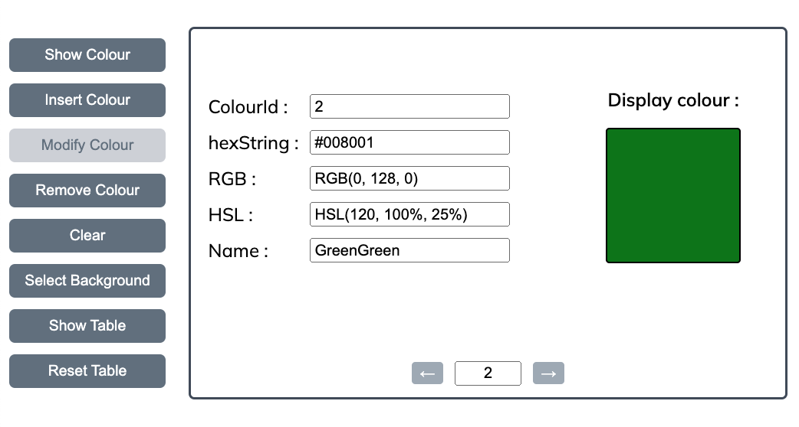

# EAD Lab 3 - Express.js 
This assignment is about using **Express.js** for managing an application that performs operations related to colours.  
The file with all the 256 colours can be downloaded from the Colours URL: https://jonasjacek.github.io/colors/  
The exact links for the JSON object is: https://www.ditig.com/downloads/256-colors.json

 
The file consists of an array of 256 elements where each element has the following fields:
 - colorId: The number of colours on the list.
 - hexString: The value in hexadecimal number
 - RGB: The code of the colour in RGB format.
 - Hsl: The code of the colour of HSL format.
 - Name: The name of the colour in plain English.
  
For example, the black colour has: {"colorId":0, "hexString":"#000000", "rgb": {"r":0,"g":0,"b":0}, "hsl": {"h":0,"s":0,"l":0}, "name":"Black"}.

  
To accomplish the assignment, you will need to create a server in Express.js that will read from a file an object in JSON format which is an array with many fields about colours. Use the methods: GET, POST, PUT, and DELETE. You can use any library/framework related to JavaScript such as Angular, React, Axios for
developing the assignment.

  

## README File
My GitHub repo is https://github.com/jinantonic/EAD-Lab-3. 
You can find the detailed README file at https://github.com/jinantonic/EAD-Lab-3/blob/main/README.md. 
This file contains clearer instructions on how to navigate my website and the parts that I have accomplished.

  

## My solution

In the **index.js** file, the port number is set as 8080.

 

Run **node public/index.js** on the terminal and check if a node server is running.

 

Once it is running successfully, go to http://localhost:8080/index.html on the browser to see the website.

 

This is the first look at the website. The main page consists of **8 buttons** on the left side, and the **colour input boxes** along with the **colour display box** on the right side. Below them, there are **left** and **right arrow buttons** for navigating and the **input box** to enter the colour id manually.

 

### First Button

Enter the colour id and click the **SHOW COLOUR** button. It retrieves and displays the details of the colour with the specified colour id.

 

### Second Button

Moving onto the second button, enter the new colour details such as hexString, RGB, HSL and Name, and click the **INSERT COLOUR** button. If I insert the new colour, the new row will be appended to the end of the table. 

 

After you get the success message, you can refresh the homepage and click **SHOW TABLE**. 

 

You can see the new colour **SteelBlueBlues** was added to the table along with the success message.

 

### Third Button

Then we move on to the **MODIFY COLOUR** button. This button modifies the colour details with the specified colour id with the new details provided in the input field.

 

Enter the new colour details such as hexString, RGB, HSL and Name, and click the **MODIFY COLOUR** button.

 

After you get the success message, you can refresh the homepage and click **SHOW TABLE**. 

 

You can see the colour **Green** was modified as **GreenGreen** with the new hexString of #008001.

 

### Third Button

